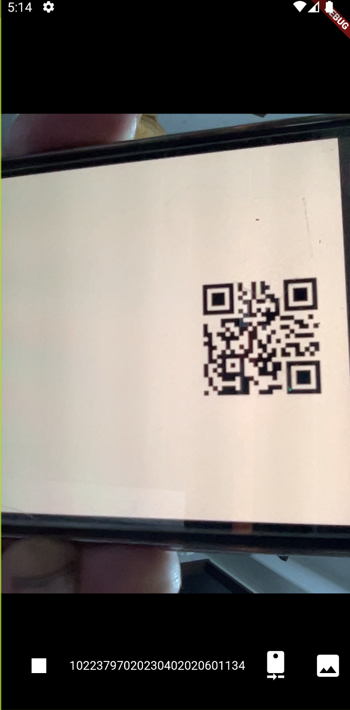

# qr_sample

## GPT4 への質問

```text
flutter 3.6 で QR コードの表示と読み取りのサンプルアプリを作ってください。
QR コードnすきゃんにはmobile_scanner を使って実装してください。
(https://pub.dev/packages/mobile_scanner にあります)
サンプルアプリのコードが
https://github.com/juliansteenbakker/mobile_scanner/tree/master/example
にあるので参考にすると良いです。

ios, android, web で動作するようにしてください。
ホーム画面から、QRコード表示画面、QR読み取り画面に移動できるようにしてください。

最初にファイル構成を示してください。
ファイルのコードグロック後に回答を分割して示してください。
"次を表示" と言ったら、次の回答を示してください。 

ファイル構成は次のようにしてください。
qr_code_sample/
  ├── android/
  ├── ios/
  ├── web/
  ├── lib/
  │   ├── main.dart
  │   ├── screens/
  │   │   ├── home_screen.dart
  │   │   ├── qr_display_screen.dart
  │   │   └── qr_scan_screen.dart
  ├── pubspec.yaml
  └── README.md 
```

## スクリーンショット

### chrome での実行


画面一番下に読み取った値 (ここでは数字列) が表示されている。


### android エミュレータでの実行


画面一番下に読み取った値 (ここでは数字列) が表示されている。
